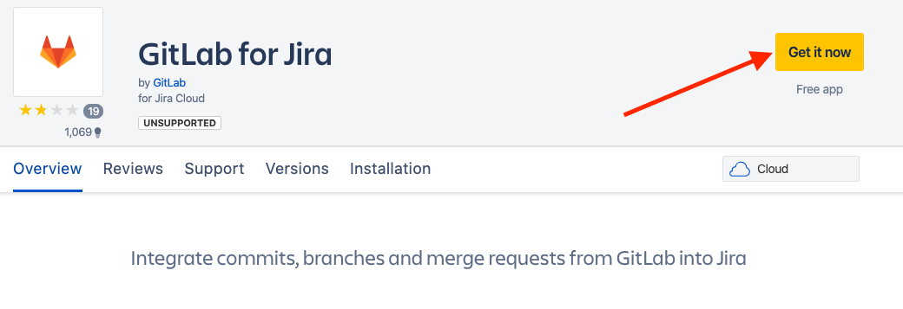
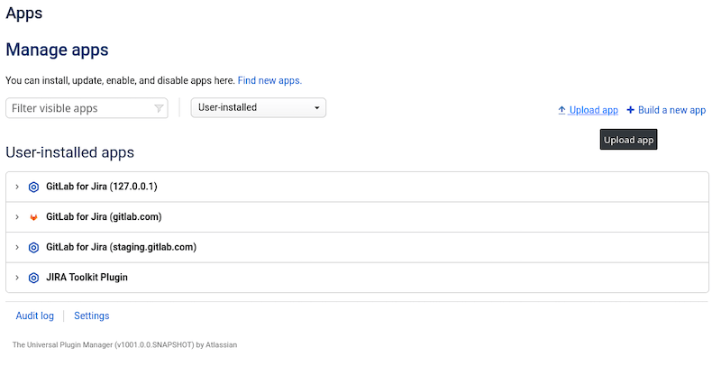

# GitLab.com for Jira Cloud app **(FREE)**

You can integrate GitLab and Jira Cloud using the
[GitLab.com for Jira Cloud](https://marketplace.atlassian.com/apps/1221011/gitlab-com-for-jira-cloud)
app in the Atlassian Marketplace.

Only Jira users with administrator access can install or configure
the GitLab.com for Jira Cloud app.

## Install the GitLab.com for Jira Cloud app **(FREE SAAS)**

If you use GitLab.com and Jira Cloud, you can install the GitLab.com for Jira Cloud app.
If you do not use both of these environments, use the [Jira DVCS Connector](dvcs.md) or
[install GitLab.com for Jira Cloud app for self-managed instances](#install-the-gitlabcom-for-jira-cloud-app-for-self-managed-instances).
We recommend the GitLab.com for Jira Cloud app, because data is
synchronized in real time. The DVCS connector updates data only once per hour.

The user configuring the GitLab.com for Jira Cloud app must have
at least the Maintainer role in the GitLab.com namespace.

This integration method supports [Smart Commits](dvcs.md#smart-commits).

<i class="fa fa-youtube-play youtube" aria-hidden="true"></i>
For a walkthrough of the integration with GitLab.com for Jira Cloud app, watch
[Configure GitLab.com Jira Could Integration using Marketplace App](https://youtu.be/SwR-g1s1zTo) on YouTube.

To install the GitLab.com for Jira Cloud app:

1. In Jira, go to **Jira Settings > Apps > Find new apps**, then search for GitLab.
1. Select **GitLab.com for Jira Cloud**, then select **Get it now**, or go to the
   [App in the marketplace directly](https://marketplace.atlassian.com/apps/1221011/gitlab-com-for-jira-cloud).

   
1. After installing, to go to the configurations page, select **Get started**.
   This page is always available under **Jira Settings > Apps > Manage apps**.

   
1. If not already signed in to GitLab.com, you must sign in as a user with
   the Maintainer role to add namespaces.

   
1. To open the list of available namespaces, select **Add namespace**.

1. Identify the namespace you want to link, and select **Link**. Only Jira site
   administrators are permitted to add or remove namespaces for an installation.

   

NOTE:
The GitLab.com user only needs access when adding a new namespace. For syncing with
Jira, we do not depend on the user's token.

After a namespace is added:

- All future commits, branches, and merge requests of all projects under that namespace
  are synced to Jira.
- From GitLab 13.8, past merge request data is synced to Jira.

Support for syncing past branch and commit data is tracked [in this issue](https://gitlab.com/gitlab-org/gitlab/-/issues/263240).

## Update the GitLab.com for Jira Cloud app

Most updates to the app are fully automated and don't require any user interaction. See the
[Atlassian Marketplace documentation](https://developer.atlassian.com/platform/marketplace/upgrading-and-versioning-cloud-apps/)
for details.

If the app requires additional permissions, [the update must first be manually approved in Jira](https://developer.atlassian.com/platform/marketplace/upgrading-and-versioning-cloud-apps/#changes-that-require-manual-customer-approval).

## Install the GitLab.com for Jira Cloud app for self-managed instances **(FREE SELF)**

If your GitLab instance is self-managed, you must follow some
extra steps to install the GitLab.com for Jira Cloud app, and your GitLab instance must be accessible by Jira.

Each Jira Cloud application must be installed from a single location. Jira fetches
a [manifest file](https://developer.atlassian.com/cloud/jira/platform/connect-app-descriptor/)
from the location you provide. The manifest file describes the application to the system. To support
self-managed GitLab instances with Jira Cloud, you can either:

- [Install the application manually](#install-the-application-manually).
- [Create a Marketplace listing](#create-a-marketplace-listing).

### Install the application manually

You can configure your Atlassian Cloud instance to allow you to install applications
from outside the Marketplace, which allows you to install the application:

1. Sign in to your Jira instance as an administrator.
1. Place your Jira instance into
   [development mode](https://developer.atlassian.com/cloud/jira/platform/getting-started-with-connect/#step-2--enable-development-mode).
1. Sign in to your GitLab application as a user with administrator access.
1. Install the GitLab application from your self-managed GitLab instance, as
   described in the [Atlassian developer guides](https://developer.atlassian.com/cloud/jira/platform/getting-started-with-connect/#step-3--install-and-test-your-app):
   1. In your Jira instance, go to **Apps > Manage Apps** and select **Upload app**:

      

   1. For **App descriptor URL**, provide the full URL to your manifest file, based
      on your instance configuration. For example: `https://your.domain/your-path/-/jira_connect/app_descriptor.json`.
   1. Select **Upload**. Jira fetches the content of your `app_descriptor` file and installs
      it.
   1. If the upload is successful, Jira displays a modal panel: **Installed and ready to go!**
      To configure the integration, select **Get started**.

      

1. Disable [development mode](https://developer.atlassian.com/cloud/jira/platform/getting-started-with-connect/#step-2--enable-development-mode) on your Jira instance.

The **GitLab.com for Jira Cloud** app now displays under **Manage apps**. You can also
select **Get started** to open the configuration page rendered from your GitLab instance.

NOTE:
If a GitLab update makes changes to the application descriptor, you must uninstall,
then reinstall the application.

### Create a Marketplace listing

If you prefer to not use development mode on your Jira instance, you can create
your own Marketplace listing for your instance. This enables your application
to be installed from the Atlassian Marketplace.

For full instructions, review the Atlassian [guide to creating a marketplace listing](https://developer.atlassian.com/platform/marketplace/installing-cloud-apps/#creating-the-marketplace-listing).
To create a Marketplace listing:

1. Register as a Marketplace vendor.
1. List your application using the application descriptor URL.
   - Your manifest file is located at: `https://your.domain/your-path/-/jira_connect/app_descriptor.json`
   - We recommend you list your application as `private`, because public
     applications can be viewed and installed by any user.
1. Generate test license tokens for your application.

NOTE:
This method uses [automated updates](#update-the-gitlabcom-for-jira-cloud-app)
the same way as our GitLab.com Marketplace listing.

## Troubleshoot GitLab.com for Jira Cloud app

### Browser displays sign-in message when already signed in

You might get the following message prompting you to sign in to GitLab.com
when you're already signed in:

```plaintext
You need to sign in or sign up before continuing.
```

GitLab.com for Jira Cloud app uses an iframe to add namespaces on the
settings page. Some browsers block cross-site cookies, which can lead to this issue.

To resolve this issue, use [Firefox](https://www.mozilla.org/en-US/firefox/),
[Google Chrome](https://www.google.com/chrome/), or enable cross-site cookies in your browser.
