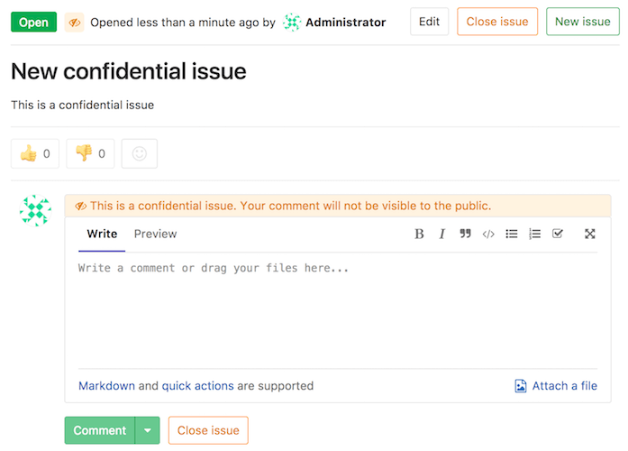
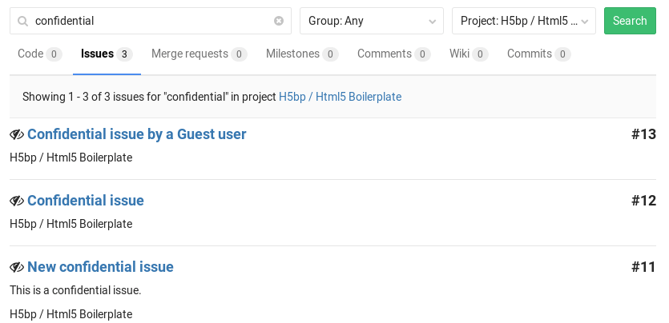

# Confidential issues **(FREE)**

Confidential issues are [issues](index.md) visible only to members of a project with
[sufficient permissions](#permissions-and-access-to-confidential-issues).
Confidential issues can be used by open source projects and companies alike to
keep security vulnerabilities private or prevent surprises from leaking out.

## Make an issue confidential

You can make an issue confidential when you create or edit an issue.

When you create a new issue, a checkbox right below the text area is available
to mark the issue as confidential. Check that box and hit the **Create issue**
button to create the issue. For existing issues, edit them, check the
confidential checkbox and hit **Save changes**.

When you create a confidential issue in a project, the project becomes listed in the **Contributed projects** section in your [profile](../../profile/index.md). **Contributed projects** does not show information about the confidential issue; it only shows the project name.

## Modify issue confidentiality

There are two ways to change an issue's confidentiality.

The first way is to edit the issue and toggle the confidentiality checkbox.
After you save the issue, the confidentiality of the issue is updated.

The second way is to locate the Confidentiality section in the sidebar and click
**Edit**. A popup should appear and give you the option to turn on or turn off confidentiality.

| Turn off confidentiality | Turn on confidentiality |
| :-----------: | :----------: |
|  |  |

Every change from regular to confidential and vice versa, is indicated by a
system note in the issue's comments.

When an issue is made confidential, only users with at least the Reporter role
for the project have access to the issue.
Users with Guest or [Minimal](../../permissions.md#users-with-minimal-access) roles can't access
the issue even if they were actively participating before the change.

## Confidential issue indicators

There are a few things that visually separate a confidential issue from a
regular one. In the issues index page view, you can see the eye-slash (**{eye-slash}**) icon
next to the issues that are marked as confidential:

If you don't have [enough permissions](#permissions-and-access-to-confidential-issues),
you cannot see confidential issues at all.

---

Likewise, while inside the issue, you can see the eye-slash icon right next to
the issue number. There is also an indicator in the comment area that the
issue you are commenting on is confidential.

There is also an indicator on the sidebar denoting confidentiality.

| Confidential issue | Not confidential issue |
| :-----------: | :----------: |
|  |  |

## Merge requests for confidential issues

Although you can create confidential issues (and make existing issues confidential) in a public project, you cannot make confidential merge requests.
Learn how to create [merge requests for confidential issues](../merge_requests/confidential.md) that prevent leaks of private data.

## Permissions and access to confidential issues

There are two kinds of level access for confidential issues. The general rule
is that confidential issues are visible only to members of a project with at
least the Reporter role. However, a guest user can also create
confidential issues, but can only view the ones that they created themselves.

Confidential issues are also hidden in search results for unprivileged users.
For example, here's what a user with the Maintainer role and the Guest role
sees in the project's search results respectively.

| Maintainer role                                                                        | Guest role                                                                     |
|:---------------------------------------------------------------------------------------|:---------------------------------------------------------------------------------|
|  |  |

## Related topics

- [Merge requests for confidential issues](../merge_requests/confidential.md)
- [Make an epic confidential](../../group/epics/manage_epics.md#make-an-epic-confidential)
- [Mark a comment as confidential](../../discussions/index.md#mark-a-comment-as-confidential)
- [Security practices for confidential merge requests](https://gitlab.com/gitlab-org/release/docs/blob/master/general/security/developer.md#security-releases-critical-non-critical-as-a-developer) at GitLab
